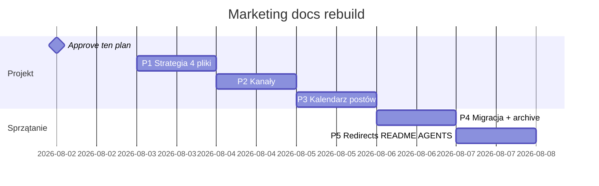

# Plan działania — marketing od nowa

> **Cel:** Jeden folder, jedna strategia, jedna lista postów, jasne kanały.  
> **Nie cel:** Kolejne runbooki rozrzucone po repo.

---

## 1. Diagnoza — dlaczego jest chaos

| Problem | Skutek dla Ciebie |
|---------|-------------------|
| Marketing w 4 miejscach (`strategy/`, `operations/runbooks`, `operations/artefacts`, `operations/media`) | Nie wiesz gdzie patrzeć |
| 3 wersje INSPIRE (v1, v2, v3) obok siebie | Nie wiesz co publikować |
| GTM + LinkedIn + Facebook — każdy ma własny README | Duplikacja, sprzeczności |
| Sesje agentów = nowy plik zamiast aktualizacji starego | 324 pliki w docs, większość nie dla Ciebie |
| Brak „co już opublikowałem” | Kalendarz ≠ rzeczywistość |

**Wniosek:** Treść strategiczna jest **dobra**. Opakowanie jest **złe**. Nie potrzebujemy nowej strategii — potrzebujemy **jednego biurka**.

---

## 2. Docelowa struktura — jeden folder

```
docs/marketing/
│
├── README.md                 ← START. Tylko tu wchodzisz na co dzień.
│
├── 01-strategia/
│   ├── dwie-marki.md         ← Quietforge sprzedaje · FlexGrafik dowodzi
│   ├── oferta-i-ceny.md      ← Map €290, wizard €199+, co gdzie
│   ├── odbiorca-icp.md        ← kto kupuje B2B, kto consumer
│   └── zasady-uczciwosci.md  ← PARTIAL, bez obietnic %, link do proof-rules
│
├── 02-kanaly/
│   ├── README.md             ← tabela: kanał · marka · CTA · tak/nie
│   ├── linkedin/
│   │   ├── profil.md         ← About, Featured, Services (paste)
│   │   └── zasady.md         ← B2B only, zero investora
│   ├── facebook/
│   │   ├── profil.md
│   │   └── zasady.md         ← consumer ZZP only
│   ├── strona-www.md         ← quietforge = konwersja, nie kanał social
│   └── kanaly-nie.md         ← TikTok B2B, Marktplaats, grupy QF — explicit NIE
│
├── 03-kalendarz-postow/
│   ├── README.md             ← kolejność publikacji + status (szkic / gotowy / opublikowany)
│   ├── seria-modulow.md      ← M0-A … M0-I (17 slotów skrócone z calendar.md)
│   ├── seria-wyciekow.md     ← W1–W4 business leaks
│   ├── kampanie/
│   │   └── inspire-li-r10/   ← JEDEN pakiet: tekst + slajdy + komentarz + checklist
│   └── zarchiwizowane/       ← v1/v2 INSPIRE — nie kasujemy, chowamy
│
├── 04-wykonanie/
│   ├── checklist-tydzien.md  ← co robić co tydzień (2 LI + 1 FB + GA4)
│   ├── featured-linkedin.md  ← B1 — 4 sloty
│   ├── start-facebook.md     ← B3 — bio + post #1
│   └── publikacja-krok-po-kroku.md  ← claim-lock → UTM → komentarz
│
├── 05-raporty/
│   ├── audyt-2026-08-02.md   ← ostatni audyt (skrót)
│   └── ga4-baseline.md       ← co mierzymy, co znaczy 0 LI sessions
│
└── archive/                  ← wszystko stare, nie ruszamy w codziennej pracy
```

**Zasada:** `docs/marketing/README.md` = jedyna strona startowa dla Dowódcy. Reszta repo (canons, handoffs) = dla agentów — **Ty nie musisz tam wchodzić**.

---

## 3. Faza projektowa — co piszemy od zera (3 sesje doc)

### Sesja P1 — Strategia (2h myślenia, 0 kodu)

**Deliverable:** 4 pliki w `01-strategia/`

| Dokument | Co musi zawierać | Źródło do przepisania (nie kopiować ślepo) |
|----------|------------------|---------------------------------------------|
| `dwie-marki.md` | Jedno zdanie per marka · co wolno · czego zakaz | `gtm/01-two-brand-model.md` |
| `oferta-i-ceny.md` | Map, build, wizard · filter €290 | `marketing-strategy.md` §8 |
| `odiorca-icp.md` | NL SMB B2B vs ZZP consumer | `gtm/04-audience-and-messaging.md` |
| `zasady-uczciwosci.md` | PARTIAL, HITL, brak % bez dowodu | `canons/marketing-rules.md` (skrót + link) |

**Decyzja do zatwierdzenia:** Priorytet przychodu = **Quietforge B2B first** (już w audycie — potwierdzasz raz na piśmie).

---

### Sesja P2 — Kanały (1,5h)

**Deliverable:** `02-kanaly/` komplet

**Tabela kanałów (docelowa — do wpisania w README):**

| Tier | Kanał | Marka | Główny CTA | Status 2026-08 |
|------|-------|-------|------------|----------------|
| **1** | LinkedIn profil + feed | Quietforge | Map €290 | **NIE GOTOWY** — Featured brak, 0 LI w GA4 |
| **1** | quietforge.flexgrafik.nl | Quietforge | Map | **GOTOWY** |
| **1** | LinkedIn DM / komentarze | Quietforge | Map po kwalif. | Proces: Jadzia draft + Ty approve |
| **2** | Facebook Page | FlexGrafik | Wizard | **NIE GOTOWY** — bio v2, 14 followers |
| **2** | Google Business | FlexGrafik | Zaufanie lokalne | Osobna sesja (poza tym planem) |
| **2** | YT Shorts / TikTok | FlexGrafik | Wizard | **PÓŹNIEJ** — repurpose z gotowych video |
| **3** | Sortlist / Clutch | Quietforge | Map | Po 1 kliencie z Map |
| **—** | Marktplaats, TikTok B2B | — | — | **NIE** |

**Grupy:** LinkedIn grupy NL = lurk + komentarz (B2B). Facebook grupy = wizard soft (consumer). **Bez auto-spamu.**

---

### Sesja P3 — Kalendarz postów (2h)

**Deliverable:** `03-kalendarz-postow/` — jedna prawda

| Element | Co robimy |
|---------|-----------|
| **Seria modułów** | 9 postów M0-A…M0-I — skrót z `linkedin/calendar.md`, pełne body zostaje w pliku serii |
| **Seria wycieków** | 8 postów W1–W4 |
| **Kampania INSPIRE** | **Tylko LI-R10 v3** — reszta do archive |
| **Status każdego slota** | Kolumna: `szkic` / `gotowy` / `opublikowany` / `nie publikować` |
| **Pierwszy post do publikacji** | INSPIRE LI-R10 (po Featured) |

**Kolejność publikacji (pierwsze 4 tygodnie):**

| Tydzień | Co | Kanał |
|---------|-----|-------|
| 0 | Featured V2 + Services | LinkedIn profil |
| 1 | INSPIRE LI-R10 karuzela | LinkedIn feed |
| 1 | FB bio v2 + Post #1 pin | Facebook |
| 2 | M0-B Wizard / quotes | LinkedIn |
| 2 | FB Post #2 | Facebook |
| 3 | M0-A Automation Map | LinkedIn |
| 4 | P2 obiekcja „€290 drogo” | LinkedIn |

Reszta wg `06-roadmap-90-days.md` — ale **jedna tabela w kalendarz-postow/README.md**, nie pięć plików.

---

## 4. Faza sprzątania — co usuwamy / chowamy (po approve P1–P3)

### Do `docs/marketing/archive/` (przenieść, nie kasować)

| Stare | Powód |
|-------|-------|
| INSPIRE v1 draft + v1 media | Superseded, zły kąt dev-chat |
| INSPIRE v2 publish pack + v2 slides | Zastąpione v3/LI-R10 |
| `dowodca-record-publish-playbook.md` | Retired workflow |
| Duplikat GTM `03-linkedin-principles` treści | Zostaje pointer w gtm/, treść tylko w kanaly/linkedin |

### Do `docs/archive/marketing-legacy/` (całe foldery historyczne)

| Źródło | Co |
|--------|-----|
| `docs/operations/plans/*gtm*` | Plany z czerwca — wykonane |
| `docs/strategy/linkedin/drafts/` (po migracji) | Puste po przeniesieniu do kampanii |
| Stare handoffs marketingowe | >30 dni, zamknięte tematy |

### Do usunięcia (hard delete — tylko po Twoim OK)

| Kandydat | Warunek |
|----------|---------|
| `scripts/build-linkedin-inspire-carousel.py` (v1) | Po potwierdzeniu że v3 wystarczy |
| `scripts/build-linkedin-inspire-carousel-v2.py` | j.w. |
| `media/linkedin-inspire-build-in-public/` (v1 PNG) | j.w. |
| `media/linkedin-inspire-v2/` | Zostawić kopie w archive lub usunąć jeśli v3 w git |

**Zasada kasowania:** Nic nie kasujemy bez checklisty „nowe SSoT istnieje + Commander ✓”.

---

## 5. Co zostaje poza `docs/marketing/` (świadomie)

| Miejsce | Dlaczego nie przenosimy |
|---------|-------------------------|
| `docs/canons/marketing-rules.md` | HARD rules dla kodu strony — warstwa prawna |
| `docs/strategy/site-map.md` | IA strony, nie outbound |
| `docs/strategy/conversion-pipeline.md` | CTA tiers — dotyczy kodu |
| `docs/operations/handoffs/` | Historia sesji agentów |
| `docs/operations/media/` | Duże pliki binarne — zostają, **linkowane** z marketingu |
| `scripts/` | Narzędzia — poza scope „zero kodu” |

**Most:** `docs/marketing/README.md` linkuje do canons tam gdzie trzeba — Ty nie musisz ich czytać.

---

## 6. Harmonogram wykonania (4 sesje, same docs)



| Sesja | Czas | Output | Kod? |
|-------|------|--------|------|
| **0** | 15 min | Ty: approve / popraw ten plan | Nie |
| **P1** | ~2h | `01-strategia/` | Nie |
| **P2** | ~1,5h | `02-kanaly/` | Nie |
| **P3** | ~2h | `03-kalendarz-postow/` + INSPIRE kampania | Nie |
| **P4** | ~2h | Przeniesienie, archive, skróty w starych README | Nie |
| **P5** | ~1h | `docs/marketing/README.md`, SESSION-ANCHOR, `docs/README.md` pointer | Nie |

**Po P5:** Stare ścieżki mają tylko jednolinijkowy redirect: „Przeniesiono do docs/marketing/…”.

---

## 7. Definicja sukcesu

| Kryterium | Jak sprawdzamy |
|-----------|----------------|
| Jedno wejście | `docs/marketing/README.md` — 5 min i wiesz co robić |
| Jedna lista postów | Kalendarz z statusem, bez duplikatów INSPIRE |
| Jasne kanały | Tabela tier 1/2/3 + explicit NIE |
| Zero śmieci w codziennej pracy | archive/ oddzielone |
| Agent nie tworzy plików poza marketing/ | Reguła w AGENTS.md (1 linia) |

---

## 8. Czego NIE robimy w tym projekcie

- ❌ Kod strony, skrypty, npm
- ❌ Publikacja postów (to Ty, osobno, po docs)
- ❌ Nowa strategia „od guru” — **porządkujemy to co mamy**
- ❌ TikTok/Shorts upload — tylko wpis w kanale „później”
- ❌ Przenoszenie 65 plików media — zostają, linkujemy

---

## 9. Następny krok — jedna decyzja

**Napisz:**

1. **„Plan OK, P1”** — zaczynam pisać `01-strategia/` (4 pliki po ludzku)  
2. **„Plan OK, ale zmień X”** — poprawiam plan przed startem  
3. **„Stop — najpierw Featured”** — pomagam krok po kroku publikacją, docs później

---

*Ten plik = kontrakt na reorganizację. Po approve nie dodajemy nowych folderów poza drzewem z §2.*
