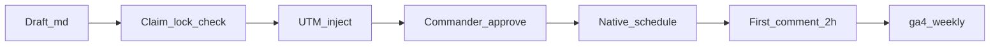

# LinkedIn Publish Pipeline v1

**Goal:** Repeatable path from draft → claim-lock → UTM → first comment → publish, with Commander approve only.



---

## Step 1 — Pick draft

| Source | Path |
|--------|------|
| Calendar | [linkedin/calendar.md](../../strategy/linkedin/calendar.md) |
| INSPIRE pack | [2026-08-02-inspire-li-r10-publish-pack.md](../../strategy/linkedin/drafts/2026-08-02-inspire-li-r10-publish-pack.md) |
| Objection bank | P2 slots in [marketing audit](../artefacts/2026-08-02-marketing-audit-quietforge.md) §6 |

---

## Step 2 — Claim-lock check

Run against [2026-07-gtm-claim-lock.md](../artefacts/2026-07-gtm-claim-lock.md):

| Gate | Rule |
|------|------|
| PARTIAL | Label on-page if proof incomplete |
| No % uplift | Unless measured + sourced |
| Links | **None in post body** — first comment only |
| Brand | Quietforge primary; FlexGrafik = proof only |
| CTA | Map or `#design-intake` — never wizard on B2B feed |
| Hashtags | Max 3: `#B2B #buildinpublic #automation` |
| Investor | **0%** on B2B feed |

**Fail any gate → fix draft before approve.**

---

## Step 3 — UTM template

```
utm_source=linkedin
utm_medium=organic
utm_campaign={pillar}-{slug}
```

Examples:

| Post | utm_campaign |
|------|----------------|
| INSPIRE carousel | `inspire-build-in-public-v3` |
| Objection €290 | `objection-map-filter` |
| Inbox leak | `leak-inbox-chaos` |

**URLs (canon):**

- Map: `https://quietforge.flexgrafik.nl/book-discovery/?utm_source=linkedin&utm_medium=organic&utm_campaign={campaign}`
- Design Intake: `https://quietforge.flexgrafik.nl/results/?utm_source=linkedin&utm_medium=organic&utm_campaign={campaign}#design-intake`
- Case: `https://quietforge.flexgrafik.nl/solutions/sales-funnel/?utm_source=linkedin&utm_medium=organic&utm_campaign={campaign}`

---

## Step 4 — First comment template

```text
Demo (NL UI, live on my site):
https://zzpackage.flexgrafik.nl/voertuigreclame-ontwerp/?utm_source=linkedin&utm_medium=organic&utm_campaign={campaign}

Book a paid Automation Map (€290, credited toward your build):
https://quietforge.flexgrafik.nl/book-discovery/?utm_source=linkedin&utm_medium=organic&utm_campaign={campaign}

Live systems — Design Intake landing (PARTIAL labelled on-page):
https://quietforge.flexgrafik.nl/results/?utm_source=linkedin&utm_medium=organic&utm_campaign={campaign}#design-intake

Wizard + Design Intake case:
https://quietforge.flexgrafik.nl/solutions/sales-funnel/?utm_source=linkedin&utm_medium=organic&utm_campaign={campaign}

DM me what you sell and how you quote today.
```

Customize middle lines per post type; **always include Map + at least one proof URL.**

---

## Step 5 — Pre-publish checklist (LI-R15)

- [ ] Hook = buyer problem, not product name
- [ ] PARTIAL honest if applicable
- [ ] No links in body
- [ ] First comment copied to clipboard before publish
- [ ] Carousel assets in order (if applicable)
- [ ] Mobile 5s test on target landing
- [ ] Commander approve ✓

---

## Step 6 — Publish + engage

1. Native LinkedIn schedule (or post now)
2. First comment within **2 hours** (LI-R14)
3. Run [ENGAGEMENT playbook](../../strategy/linkedin/drafts/) — 15 min same day
4. Log in calendar: date · campaign · pillar

---

## Step 7 — Measure

Monday: `npm run ga4:weekly` → check `linkedin / organic` sessions + Map funnel.

---

## Automation roadmap (v2)

| Feature | Status |
|---------|--------|
| Draft from calendar + proof.ts | Planned |
| Auto UTM inject in comment block | Planned |
| claim-lock linter script | Planned |
| Buffer/API schedule | **Not recommended** — native safer |

---

## Anti-patterns

- Auto-DM without context
- Links in post body (algorithm + canon)
- FlexGrafik wizard CTA on B2B feed
- Investor / funding posts
- Publishing without first comment ready
