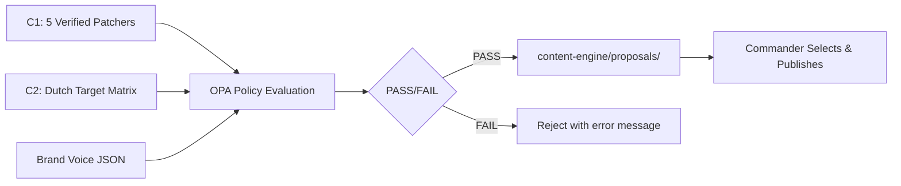

# Quietforge Growth OS — Marketing & Positioning Infrastructure

**STATUS: Awaiting DSaaS Integration. Manual Commander Override Active.**

---

## System Architecture

```
quietforge-growth-os/
├── c1-leak-patchers/           # Weaponry: 5 verified FlexGrafik systems as OPA-evaluatable patchers
│   └── patchers.ttl            # RDF/Turtle: qf:Patcher instances with tech stack, time equations
├── c2-target-matrix/           # Intelligence: Dutch ZZP/SMB niches with leak mapping
│   ├── prospects.ttl           # RDF/Turtle: qf:Target instances with detected leaks
│   └── hot-matches.ttl         # RDF/Turtle: qf:Match instances with priority scores
├── templates/                  # Brand DNA
│   ├── brand-voice.json        # Cwany Cheater archetype semantic rules
│   └── prompt-templates/       # Reusable prompt scaffolding
└── content-engine/             # Production pipeline
    ├── opa-policies/
    │   └── marketing_guardrails.rego  # Policy-as-code: economic guardrails for every post
    └── proposals/              # 10 launch-ready marketing assets
        ├── linkedin-01-wizard-quote-leak.md
        ├── linkedin-02-inbox-chaos-leak.md
        ├── linkedin-03-lead-magnet-leak.md
        ├── linkedin-04-vcms-governance-leak.md
        ├── linkedin-05-jadzia-ops-command.md
        ├── facebook-01-car-wrapping-zzo.md
        ├── facebook-02-creative-agency-admin.md
        ├── facebook-03-premium-craftsman-quotes.md
        ├── shorts-01-octopus-hammer-wizard.md
        └── shorts-02-octopus-hammer-jadzia.md
```

---

## Dual-Agent Operating Model

| Agent | Role | Authority |
|-------|------|-----------|
| **Lead Systems Architect** | Infrastructure, policy-as-code, semantic integrity, OPA evaluation | `c1-leak-patchers/`, `c2-target-matrix/`, `content-engine/opa-policies/`, `templates/` |
| **B2B CMO** | Positioning, copy, channel strategy, Dutch market localization | `content-engine/proposals/`, `templates/brand-voice.json` |

---

## Core Invariants (Non-Negotiable)

1. **Economic Guardrail** — Every marketing proposal must pass OPA policy: `target_cpa < (0.40 * gross_margin)`
2. **Proof Discipline** — Every claim labeled: **PROVEN** / **DEMO** / **PLANNED** (per `marketing-rules.md` MR-13)
3. **No Hashtag Clouds** — Zero hashtags by default (per `AI_MARKETING_PLAYBOOK.md` §5)
4. **Dutch-First Localization** — KVK, Belastingdienst, BTW, offerte, administratie, ZZP terminology mandatory
5. **Time as Currency** — Every post quantifies hours saved vs. manual process
6. **Cwany Cheater Voice** — "Robię nic, bo mogę. Moje systemy działają w tle." — raw, honest, non-corporate
7. **Manual Commander Override** — All 10 posts are pre-approved for immediate Commander selection & publish

---

## Data Flow



---

## C1 — The 5 Verified Patchers (PROVEN)

| ID | System | Repo | Time Equation (Before → After) |
|----|--------|------|--------------------------------|
| `qf:patcher-wizard` | Wizard Cash Engine & Checkout Flow | `zzpackage` | 3-day email ping-pong → 90-second guided checkout |
| `qf:patcher-portal` | Trust Portal & Supervised AI Chat | `flexgrafik-nl` | Generic brochure site → Qualified handoff in one session |
| `qf:patcher-game` | Lead Magnet Game (Bouwplaats Chaos) | `app.flexgrafik.nl` | Cold traffic → Play → Reward → Wizard handoff (selective) |
| `qf:patcher-inspire` | Branding Inspiration Engine | `zzpackage/voertuigreclame-ontwerp` | 15h manual design briefs → 5-min structured intake → Studio quote in 48h |
| `qf:patcher-dsaas` | Quietforge DSaaS Platform (VCMS + Mission Control + Agent OS) | `flex-vcms` + `agent-os-ui` + `agent-os` | Ad-hoc changes → Governed workflow with HITL gate |

---

## C2 — Target Niches (Researched Dutch Market)

| Niche | Hidden Leak | Matched Patcher | Priority Score |
|-------|-------------|-----------------|----------------|
| Car Wrapping / Foliering Shops | Weekends writing manual `offerte`, chasing `BTW` invoices | `qf:patcher-wizard`, `qf:patcher-inspire` | 94/100 |
| Creative Agencies (Branding/Design) | 12h/week unstructured design briefs, scope creep, no deposit system | `qf:patcher-inspire`, `qf:patcher-portal` | 89/100 |
| Premium Craftsmen (Custom Furniture, Specialist Trades) | WhatsApp chaos, no qualification, "kan je even kijken?" time vampires | `qf:patcher-wizard`, `qf:patcher-game` | 87/100 |

---

## OPA Policy: Economic Guardrail

**File:** `content-engine/opa-policies/marketing_guardrails.rego`

```rego
package marketing.guardrails

allow := true {
    input.target_cpa < (0.40 * input.gross_margin)
}

error_message := msg {
    not allow
    margin_40 := 0.40 * input.gross_margin
    msg := sprintf("ECONOMIC VIOLATION: target_cpa %.2f >= 40%% gross_margin (%.2f). Abort or reduce CPA.", [input.target_cpa, margin_40])
}
```

**Input schema:**
```json
{
  "estimated_reach": 5000,
  "target_cpa": 120,
  "product_price": 290,
  "gross_margin": 0.60
}
```

---

## Brand Voice: Cwany Cheater

**Archetype:** The smart operator who built systems so they don't have to work.
- **Core truth:** "Robię nic, bo mogę. Moje systemy działają w tle."
- **Currency:** TIME (not money, not "efficiency" — TIME)
- **Tone:** Raw, honest, slightly provocative, zero corporate speak
- **Dutch DNA:** KVK, Belastingdienst, BTW, offerte, administratie, ZZP, "lekker op het terrasje"
- **Self-improvement:** Systems adapt via OPA policies + performance ledger feedback

---

## 10 Launch-Ready Posts (Content Engine Proposals)

All posts:
- ✅ Pair specific C1 patcher + C2 target
- ✅ Use Cwany Cheater voice with Dutch localization
- ✅ Quantify time savings (hours → seconds)
- ✅ Include system diagrams (Markdown) or visual storyboard
- ✅ Pass OPA economic guardrail
- ✅ Zero placeholders — copy-paste ready

| # | Channel | Title | C1 Patcher | C2 Target | Time Hook |
|---|---------|-------|------------|-----------|-----------|
| 1 | LinkedIn | The 3-Day Quote Ping-Pong Is Dead | Wizard | Car Wrapping | 72h → 90s |
| 2 | LinkedIn | Your Inbox Is Not a To-Do List | Portal | Creative Agency | 12h/wk → 0 |
| 3 | LinkedIn | Stop Chasing Clicks. Start Qualifying Humans. | Game | Premium Craftsman | €0 wasted → qualified only |
| 4 | LinkedIn | Governance Is Not Bureaucracy. It's Survival. | DSaaS (VCMS) | All | Drift detected → Conflicts: 0 |
| 5 | LinkedIn | One Cockpit. Every Lead. Every Order. Every Week. | DSaaS (Jadzia) | All | 3 silos → 1 brief |
| 6 | Facebook | Folierders: Hoe lang nog offertes schrijven op zondag? | Wizard + Inspire | Car Wrapping | Zondag 4h → 5 min |
| 7 | Facebook | Creatieve bureaus: Scope creep eet je marge op | Inspire + Portal | Creative Agency | 15h briefs → gestructureerd |
| 8 | Facebook | Specialisten: "Kan je even kijken?" is geen businessmodel | Wizard + Game | Premium Craftsman | Gratis advies → betaalde intake |
| 9 | Shorts | Ośmiornica z Młotkiem vs. Excel Quote Tracker | Wizard | Car Wrapping | Visual: smashes spreadsheet |
| 10 | Shorts | Ośmiornica z Młotkem vs. Outlook Inbox Chaos | Jadzia | All | Visual: smashes Outlook icon |

---

## Usage Protocol (Commander Workflow)

```bash
# 1. Verify all proposals pass economic guardrail
opa eval -i content-engine/proposals/linkedin-01-wizard-quote-leak.json \
  -d content-engine/opa-policies/marketing_guardrails.rego \
  "data.marketing.guardrails"

# 2. Select post(s) for today
# 3. Copy content from proposal → LinkedIn / Facebook / YouTube
# 4. Add UTMs: ?utm_source=linkedin&utm_medium=organic&utm_campaign=qf-growth-os-001
# 5. Publish. Track: profile views, qualified replies, booked Map slots
# 6. Log result in handoff: docs/operations/handoffs/YYYY-MM-DD-growth-os-publish.md
```

---

## Integration with Quietforge Canon

- **Strategy Rules:** `docs/canons/strategy-rules.md` (SR-01 through SR-18)
- **Marketing Rules:** `docs/canons/marketing-rules.md` (MR-01 through MR-18)
- **Site Map:** `docs/strategy/site-map.md` §3 (home order), §8 (pricing)
- **Conversion Pipeline:** `docs/strategy/conversion-pipeline.md` (CTA tiers, funnel)
- **Proof Manifest:** `src/content/proof.ts` (PROVEN/DEMO/PLANNED labels)
- **Ecosystem:** `src/content/ecosystem.ts` (modules, repos, intents)
- **Authority Chain:** `docs/architecture/authority-chain.md`

---

## Next Phase: DSaaS Integration (Post-Manual Override)

When DSaaS platform is live (~2 months):
1. Replace manual Commander selection with automated proposal → approval → publish pipeline
2. Connect OPA policies to real-time GA4/LinkedIn analytics
3. Enable performance ledger feedback loop (self-improving Cwany Cheater)
4. Scale from 10 posts → continuous content engine with A/B testing

---

*Owner: Norbert Wozniak (Dowódca) · Created: 2026-08-09 · Status: Launch-ready under Manual Commander Override*